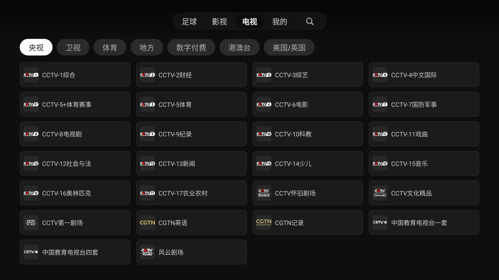
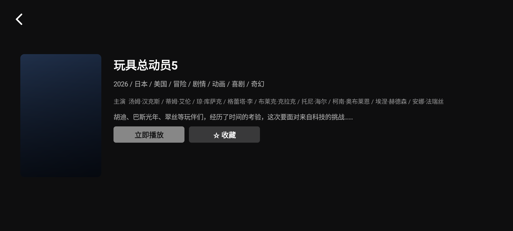

# My TV（OptimalTV 工程）

My TV 是一款面向电视大屏、手机和平板的原生影视应用，采用 Kotlin、Jetpack Compose 和 Media3 构建。影视信息由豆瓣目录提供，播放使用项目内已配置的影视源；足球、电视和影视解析由 APK 内置 Python 后端在每台设备上直接访问公网完成，不依赖自建业务服务器。

## 产品展示

### TV 大屏频道浏览



### 手机与平板影视详情



### 影视搜索与内容发现


## 项目亮点

- 面向 TV 遥控器交互优化，支持大屏焦点导航与播放器控制
- Android TV、手机和平板多端适配，统一数据与播放能力
- 支持直播、点播、分类筛选、搜索、收藏和影视详情
- 内置 Python 后端，支持后端与 Web 资源无弹窗热更新；原生 UI 通过签名 APK 更新

Android 原生影视应用（TV 大屏 + 手机/平板双端）+ 云端网页版。Kotlin + Jetpack Compose + Media3，
tvOS 深色风格；Python 后端内嵌进 app（Chaquopy），设备端自给自足。商业化 = 卡密付费（公测版）。

> 📋 **文档总入口**见 **[docs/README.md](docs/README.md)**；架构看 **[项目文档](docs/01-overview/项目文档.md)**，
> 构建发布看 **[开发与发布手册](docs/02-guides/开发与发布手册.md)**。本 README 只做结构介绍与快速上手。

## 快速使用

| 我想… | 怎么做 |
|---|---|
| 用网页版 | 手机浏览器打开 https://appletv-d5ge1bth794873f76.service.tcloudbase.com/web/ （首次「风险提醒」点确定即过；卡密/电视源接口已指向自建站点） |
| 进后台管理 | https://mytv-cloud.pengzhiyuan0724.chatgpt.site/ · 账号 `admin`，密码 = 站点环境变量 `OTV_ADMIN_PASS` |
| 本地构建后端与网页 | `python tools/release_all.py`（默认只在本机生成部署包和 App 热更新包，不触碰公网） |
| 部署/推送 | 用户明确确认范围后，运行 `python tools/release_all.py --deploy` 部署网页版，再到后台「热更新」页上传/发布；APK 分发另行确认 |
| 发新 APK | `android/` 或 `internal/mobile/` 下 `./gradlew assembleRelease`（v1.19 起双 flavor 退役，单线发布），产物自动归档到 `apk/` |
| 签发卡密 | `python tools/license_gen.py gen --plan <套餐> --count <数量>` → `python tools/db_import.py out/<批次>`；协议迁移/存量重置见 `tools/license_v2_*.sql` 与 `tools/license_v2_reset.py` |
| 验证改动 | MuMu 模拟器实测（截图 + logcat tag `OTV`），记录进 `docs/04-records/测试记录.md`；网页版改动**必须浏览器实测** |

发布边界：所有任务先在本机完成构建、验证并报告产物；部署云函数、上传/发布热更新、分发 APK、远程 Git push 等外部动作，必须单独经过用户明确确认（G3）后执行。

## 目录结构

```
My TV/
├── android/                  # TV 版工程（Kotlin + Compose TV）
│   └── app/src/main/
│       ├── java/com/qiubo/optimaltv/
│       │   ├── data/         # 数据层：repo（直播/点播/IPTV）、source、db(Room)、prefs；UrlGuard 双层 SSRF 防护
│       │   ├── playback/     # 播放层：引擎调度、解密中继、VlcEngine 兜底
│       │   ├── license/      # 卡密激活/本地验签/离线授权
│       │   ├── hotupdate/    # HotUpdateManager 热更下载与坏包防护
│       │   ├── ui/           # 界面：home/all/detail/search/live/tv/player/paywall…
│       │   │                 #   （OtvNav 焦点引擎在 components/Focus.kt）
│       │   └── App.kt / MainActivity.kt / EmbeddedBackend.kt   # 启动门闸、内嵌后端管理
│       ├── assets/           # python-backend.zip（内嵌后端=热更对象）、iptv_curated.m3u、logos/、拼音词典
│       ├── python/           # Chaquopy Python 源码（proxy.py 后端、scraper 等）
│       └── cpp/pinyinime/    # AOSP 谷歌拼音解码器（搜索页拼音候选）
├── internal/mobile/          # 移动版工程（触屏；data/playback/license 与 TV 版字节级一致，sync_shared.py 监管）
├── cloudfunctions/           # CloudBase 云函数（部署包）
│   │                         #   2026-09-15：后台管理已完整下线（otv-admin 函数删除、/admin 无上游），
│   │                         #   线上后台在自建站点（见同级仓库 MyTV-Cloud）；activate/hotupdate/
│   │                         #   iptv-rebuild 仍服务存量设备，待 v1.26 铺开后再下线
│   ├── activate/             # 卡密激活（已迁自建站点，留作回滚）
│   ├── hotupdate/            # 热更 check/report + 公告下发（已迁自建站点，留作回滚）
│   ├── iptv-rebuild/         # 电视源每日 06:30 自动推流（已由 /iptv/refresh 取代）
│   ├── otv-admin/            # 旧后台管理（已下线，仅源码参考；不可再视作线上入口）
│   └── otv-web/              # 网页版（含 www/ 前端；源码 tools/backend-src/）★ 仍在用
├── tools/                    # 构建/运维脚本 + 旧后台 UI 源码（admin.html/admin_server.py）+ SQL 迁移
├── docs/
│   ├── README.md             # 文档总入口
│   ├── 01-overview/          # 当前架构与项目现状
│   ├── 02-guides/            # 开发、发布和云端操作指南
│   ├── 04-records/           # 版本史与测试记录
│   ├── superpowers/          # 设计规格与实施计划
│   └── assets/               # 文档截图和展示素材
└── apk/                      # 构建产物（TV版/ 移动版/ 归档-旧版/）
```

> 后台管理、卡密激活、热更分发、电视源发布的新实现不在本仓库，见同级仓库
> **[MyTV-Cloud](../MyTV-Cloud)**（Sites / Cloudflare Worker + D1 + R2）；线上入口
> https://mytv-cloud.pengzhiyuan0724.chatgpt.site 。

## 三条铁律

1. **改动默认同步所有版本**（TV + 移动 + 网页版，共享层跑 `tools/sync_shared.py`，改 proxy.py 需双构建重部署）——除非明确说只改某端。
2. **私钥与凭据不出本机**（`tools/keys/`、codes.csv 不进 git、不进云、不贴会话）。
3. **两工程不要并行构建**（构建目录虽已分治，历史教训仍在）。

## 当前版本

TV / 移动 APK **v1.25**（versionCode 27）· 网页版 **v1.25** · 热更 **v16**（已发布）。逐版本变更与实测证据见
`docs/04-records/版本史.md` 与 `docs/04-records/测试记录.md`。
